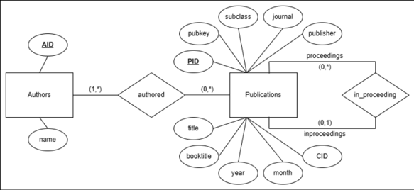

# dblp-data-pipeline

In  this project, you will find:
- `sax_parser.ipynb` - Parser of the raw data file `dblp.xml`.
- `data_transformation.sql` - Dataset schema definition and transformation in PostgreSQL.
- `dblp.xml` - Sampled raw data file. To get the full and updated data file, go to https://dblp.org/xml/.
- `dblp.dtd` - Raw data definition file.
- `dblp_parsed_final.csv` - Parsed raw data file, currently contains sampled data only.

The project goal is to apply ETL process from static semi-structured dblp raw data to relational database in PostgreSQL of publication dataset. The first challenge is the dataset does not have predefined schema, hence we must design a database schema that accurately captures the real-world meaning. Secondly, we have to work with large semi-structured data that we can not load directly to relational database system such as PostgreSQL. Lastly, we must transform the raw data into our wanted schema. To address these challenges, we must define the appropriate relational schema, parse the raw data in streaming fashion to a single relational data, and finally apply transformation to achieve our schema using SQL.

## Schema Definition

Every record entry in `dblp.xml` is a publication. We observed that some publication have multiple authors, and of course an author can authors many publications. For this project we will focus on these 2 entities: **publications** and **authors**. Below are a sample record entry showing a publication with multiple authors.
```
<incollection mdate="2017-07-12" key="reference/vision/PoggioU14" publtype="encyclopedia">
<author>Tomaso A. Poggio</author>
<author>Shimon Ullman</author>
<title>Machine Recognition of Objects.</title>
<pages>469-472</pages>
<year>2014</year>
<booktitle>Computer Vision, A Reference Guide</booktitle>
<ee>https://doi.org/10.1007/978-0-387-31439-6_793</ee>
<url>db/reference/vision/vision2014.html#PoggioU14</url>
</incollection>
```

We also have to consider a relationship between proceedings and inproceedings. Both are regarded as a single publication record entry in the file, but there are many publication or paper (inproceeding) in a single proceedings. Below are an example of an inproceedings `conf/kdd/FayyadCRPCL17` related to the proceedings `conf/kdd/2017`.
```
<proceedings key="conf/kdd/2017" mdate="2017-08-15">
<title>
Proceedings of the 23rd ACM SIGKDD International Conference on
Knowledge Discovery and Data Mining, Halifax, NS, Canada, August 13 -
17, 2017
</title>
<booktitle>KDD</booktitle>
<publisher>ACM</publisher>
<year>2017</year>
<isbn>978-1-4503-4887-4</isbn>
<ee>http://doi.acm.org/10.1145/3097983</ee>
<url>db/conf/kdd/kdd2017.html</url>
</proceedings>

<inproceedings key="conf/kdd/FayyadCRPCL17" mdate="2017-08-25">
<author>Usama M. Fayyad</author>
<author>Arno Candel</author>
<author>Eduardo Ariño de la Rubia</author>
<author>Szilárd Pafka</author>
<author>Anthony Chong</author>
<author>Jeong-Yoon Lee</author>
<title>
Benchmarks and Process Management in Data Science: Will We Ever Get
Over the Mess?
</title>
<pages>31-32</pages>
<year>2017</year>
<booktitle>KDD</booktitle>
<ee>https://doi.org/10.1145/3097983.3120998</ee>
<crossref>conf/kdd/2017</crossref>
<url>db/conf/kdd/kdd2017.html#FayyadCRPCL17</url>
</inproceedings>
```

With both factor is considered, we can define the entities and their relationships, with only including important attribute that holds value to our future data usecase. This is the final E/R schema that we will implement.


## Data Extraction

The extraction is implemented in `sax_parser.ipynb`, and extracted the raw `dblp.xml` file into `dblp_parsed_final.csv`. The extraction using SAX parser which processing in a streaming way to avoid huge memory usage on extracting the data. The parser will retain its publication granularity, with multiple values in a single publication, e.g. multiple authors, is separated by semicolon delimiter. After the extraction complete, we can take the extracted CSV file to be loaded on relational database system to do further transformation.


## Data Loading and Transformation

In this project, we are using postgreSQL for the relational database system, all the process and its recorded runtime can be seen in `data_transformation.sql`. The whole process can be summarized into 4 steps:
1. Data loading, load the extracted CSV data into the database.
2. Schema definition, defining relational schema for main and staging tables.
3. Data transformation, populate staging and main tables.
4. Finalize table, schema alterations and dropping no longer used staging tables.

After the process finished, the ETL process is complete and now our data can answer questions.
